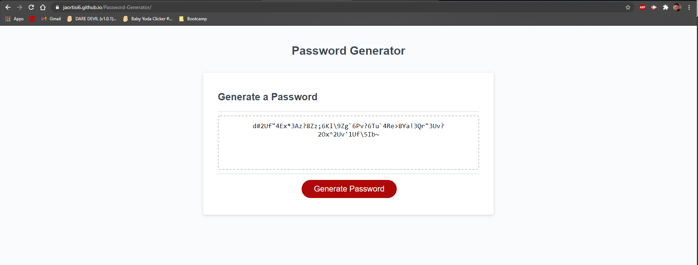

# Password Generator

# Screenshot of site

# Link to site
[Password Generator](https://jaortisi6.github.io/Password-Generator/)

## Assignment
When the user clicks the "Generate Password" button, the site prompts the user for the necessary criteria and builds the password accordingly. They can select the length of the password between 8 and 128 characters and can choose to include upper case characters, lower case characters, numbers, and/or symbols.

The password generator was created using JavaScript to meet the acceptance criteria.